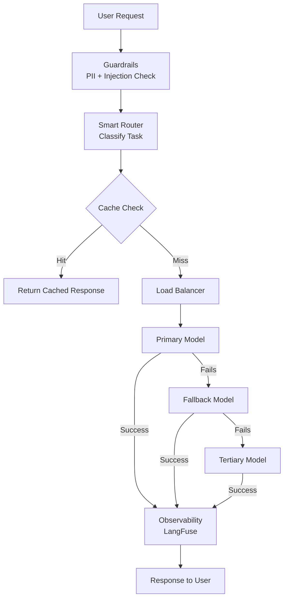
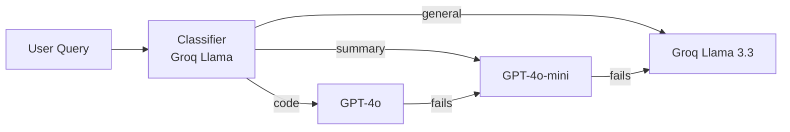
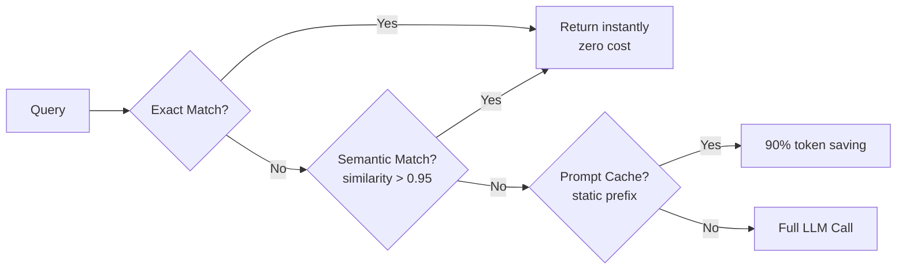

# LLM Gateway

[](https://python.org)
[](https://litellm.ai)
[](https://langchain.com)
[](LICENSE)

I built this to solve a real problem — when you're using multiple LLM providers (OpenAI, Anthropic, Groq, Gemini) across different apps, things get messy fast. Different SDKs, no fallbacks, no cost visibility, sensitive data reaching the LLM. This project fixes all of that in one place.

> OpenAI had a 4-hour outage on Nov 8, 2023. Apps like Cursor and Notion AI went completely dark. This gateway prevents that.

## Problem

| Pain Point | Without Gateway | With Gateway |
|---|---|---|
| Multiple SDKs | Separate SDK per provider | One unified API |
| Provider outage | App goes down | Auto fallback to backup |
| Cost tracking | Manual logging | Built-in per-call tracking |
| Repeated queries | Pay every time | Cache hits = zero cost |
| PII in prompts | Reaches LLM | Redacted before API call |
| Model switching | Rewrite code | Config change only |

## How it works



## What it does

| Feature | Description |
|---|---|
| Unified API | One function call works across all providers |
| Automatic Fallbacks | Primary fails, auto-switches to backup |
| Smart Routing | Routes each query to the right model |
| Caching | Exact, semantic, and prompt prefix caching |
| Cost Tracking | Token and dollar cost per call |
| Guardrails | PII redaction + prompt injection blocking |
| Observability | Full tracing with LangFuse |

## Routing Logic



## Cache Layers



## Stack

- [LiteLLM](https://litellm.ai) — unified LLM API
- [LangChain](https://langchain.com) — chaining and agents
- [LangFuse](https://langfuse.com) — observability
- Redis + FAISS — semantic caching

## Setup

```bash
# clone karo
git clone https://github.com/Abhi291712/llm-gateway.git
cd llm-gateway

# uv install karo (agar nahi hai)
curl -LsSf https://astral.sh/uv/install.sh | sh

# dependencies install karo
uv sync

# env setup karo
cp .env.example .env
# add your API keys in .env
	
```

## Project Structure

```
src/
├── basic_completion.py       # unified API across providers
├── fallbacks.py              # automatic fallback logic
├── smart_router.py           # classify + route to right model
├── load_balancer.py          # distribute load across API keys
├── cost_tracking.py          # per-call cost visibility
├── caching/
│   ├── exact_cache.py        # string match cache
│   ├── semantic_cache.py     # embedding similarity cache
│   └── prompt_cache.py       # prefix caching for large prompts
├── guardrails/
│   ├── pii_redaction.py      # mask sensitive data
│   └── prompt_injection.py   # block jailbreak attempts
└── observability/
    └── langfuse_integration.py
```

## Quick Example

```python
from litellm import completion

# works with any provider
response = completion(
    model="gpt-4o-mini",
    messages=[{"role": "user", "content": "Explain RAG"}]
)

# fallback if primary fails
response = completion(
    model="gemini/gemini-1.5-flash",
    fallbacks=["gpt-4o-mini", "groq/llama-3.3-70b-versatile"],
    messages=[{"role": "user", "content": "Explain RAG"}]
)
```

## Demo

> GIF coming soon — smart router + fallback + PII redaction in action

## Author

Abhishek Kumar — [LinkedIn](https://linkedin.com/in/abhishek-k-16239ba7/)
